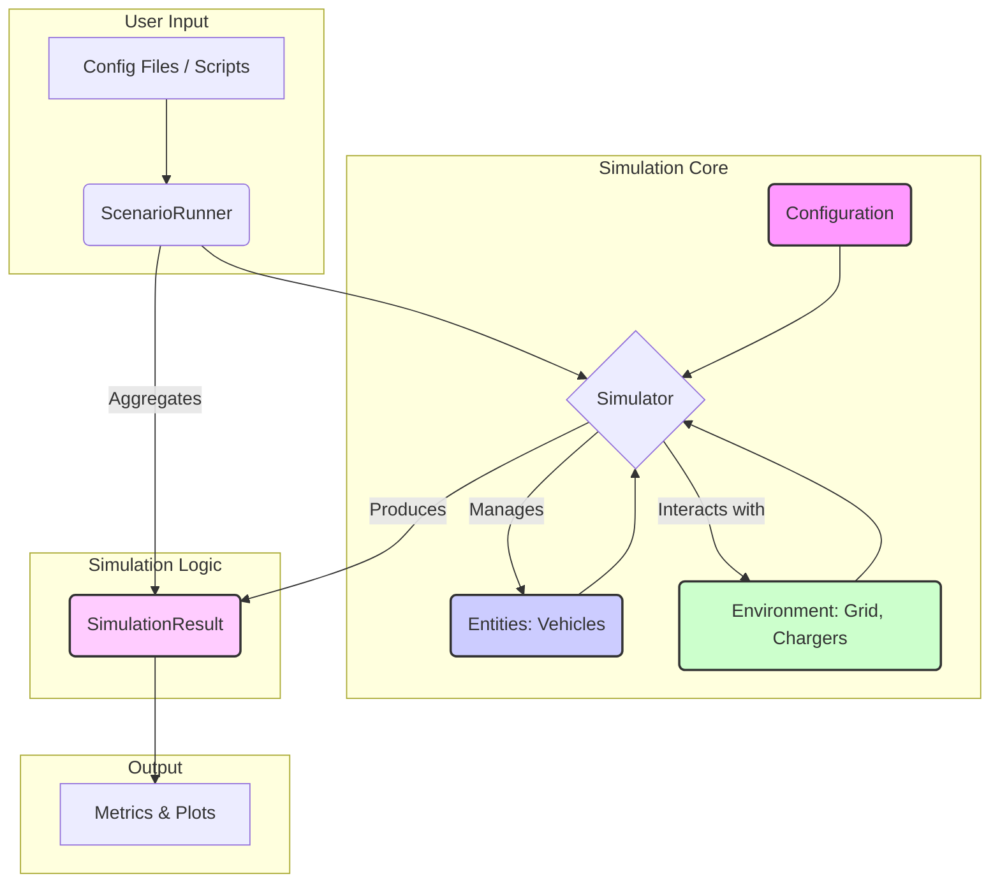
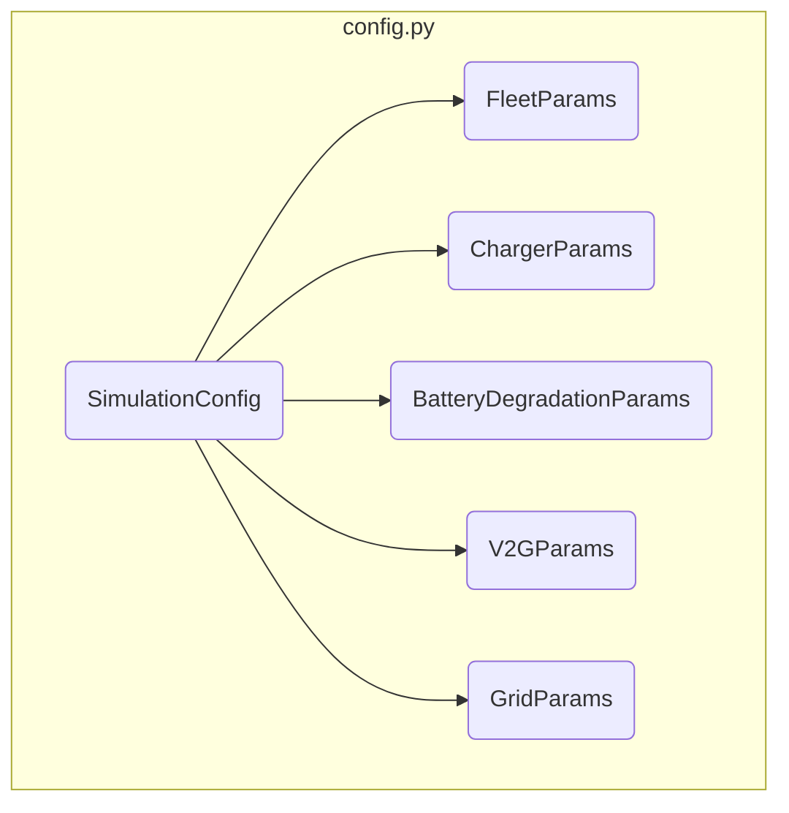
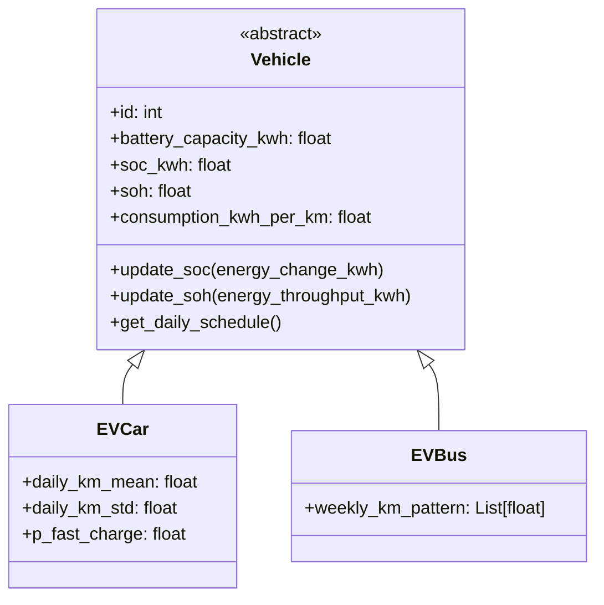
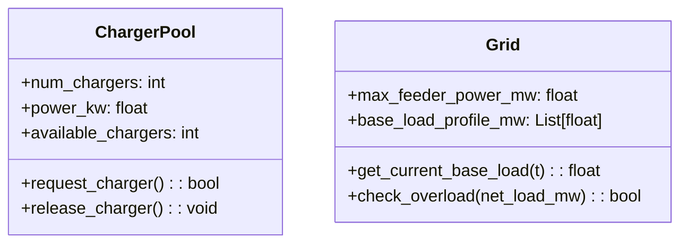
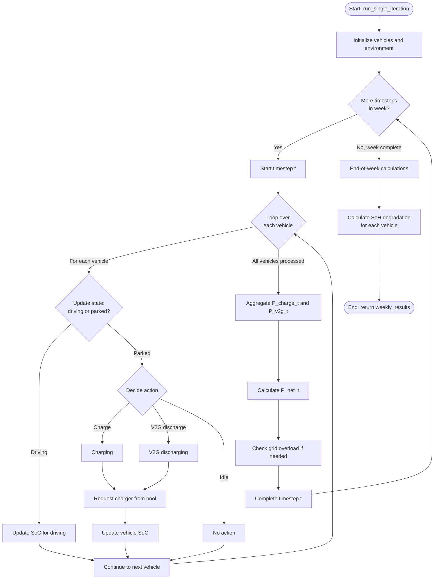
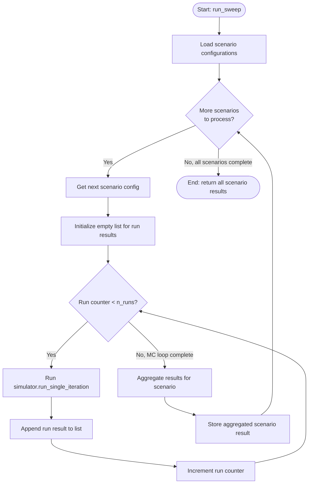

## System Architecture & Design

This section outlines the proposed software architecture for the simulation engine. The design emphasizes modularity, configurability, and extensibility, adhering to the non-functional requirements.

### 1. Overall Architecture

The simulation engine is composed of several interconnected modules that manage configuration, simulation entities, the core simulation loop, and results aggregation. The `ScenarioRunner` acts as the main orchestrator, taking user-defined configurations and managing the Monte-Carlo runs, while the `Simulator` executes the core time-step-based logic for a single weekly run.



### 2. Module Breakdown

The simulation will be built within a dedicated `simulation` submodule, with the following structure:

```
simulation/
├── __init__.py
├── config.py         # Pydantic/dataclasses for all input parameters
├── entities.py       # Vehicle, EVCar, EVBus classes
├── environment.py    # Grid, ChargerPool classes
├── main.py           # Top-level entry point for running simulations
├── results.py        # Dataclasses for storing and handling simulation results
├── scenarios.py      # ScenarioRunner class to manage sweeps
├── simulator.py      # Core Simulator class with the main time loop
└── utils.py          # Helper functions, distributions, etc.
```

---

### 3. Submodule Details

#### 3.1. `config.py` - Configuration Management

This module defines the data structures for all simulation inputs, using Pydantic or dataclasses to ensure type safety and clear validation. It directly maps to the `Inputs & API design` section.



#### 3.2. `entities.py` - Vehicle Modeling

This module contains the classes that represent the agents in our simulation: the vehicles. A base `Vehicle` class will define common attributes and methods, with specialized classes for `EVCar` and `EVBus`.



#### 3.3. `environment.py` - Grid and Chargers

This module models the static components of the simulation world: the electrical grid and the charger infrastructure.



#### 3.4. `simulator.py` - Core Simulation Engine

This is the heart of the engine, containing the main time-step loop for a single Monte-Carlo run. It orchestrates the interactions between vehicles and the environment.



#### 3.5. `scenarios.py` - Monte-Carlo and Scenario Management

This module wraps the `Simulator` to perform the Monte-Carlo analysis and manage sweeps across different scenarios. It is the primary entry point for users.


